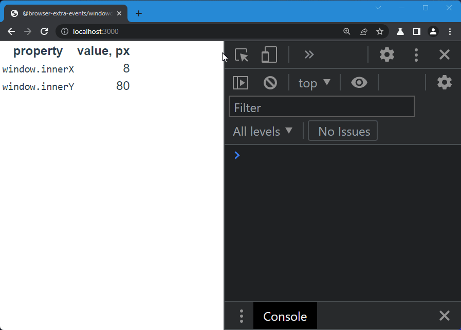

# @browser-extra-events/windowdisplace

Fires `displace` event on [`window`] each time the inner window changes its position relative to upper-left corner of the browser window.

> NOTE: It relies on mouse events, therefore to catch viewport reposition the user pointer (mouse) should be inside the client viewport. 



## Usage

With bundlers:

```
npm install @browser-extra-events/windowdisplace
```

and

```js
import '@browser-extra-events/windowdisplace'
```

Plain html:

```html
<script
  src="https://cdn.jsdelivr.net/npm/@browser-extra-events/windowdisplace/dist/windowdisplace.min.js">
</script>
```

[`window`]: https://developer.mozilla.org/en-US/docs/Web/API/Window
